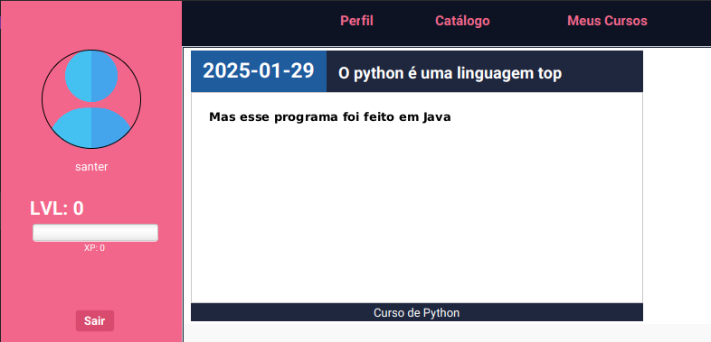
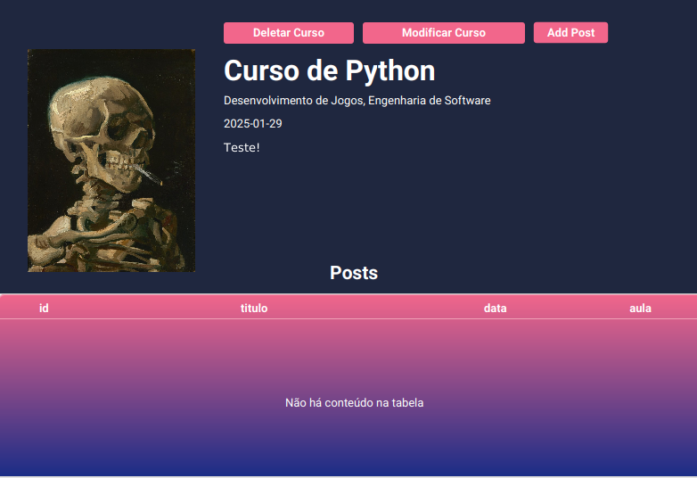

# EnigmaFX

O projeto consiste em um sistema similar a plataforma Alura, onde é possível
manipular posts, usuários, exames, aulas. É possível publicar cursos, aulas dentro desse cursos, que podem ser em vídeos ou posts/exames postados pelos professores, e os alunos podem assistir aulas, resolver exames e etc. De adicional, o sistema tem uma gamificação onde por cada ação, o usuário vai upando o XP de acordo com cada ação realizada.

## 🚀 **Funcionalidades**

### O usuário poderá:
- Se matricular em curso;
- Assistir aula;
- Responder exame;
### **O professor poderá:**
- Publicar curso;
- Publicar exame;
- Publicar post / aula;
### Gera XP (atividade):
- Assistir aula
- Resolver Exame
- Publicar Exame
- Publicar Curso
#### Funcionalidades extras:
##### Algumas verificações implementadas:
- Verificação de Itens do Menu
- Adicionar múltiplas categorias (basicamente fazendo inserts & deletes em uma outra tabela)
##### REGEX:
- Validação de Nome (somente letras)
- Validação de Login (alfanumérico sem espaço)
- Validação de Data (dd/mm/YYYY)
- Mascarar senha
#### Conversão:
- Conversão de String para Data
- Conversão de Data Americana para String com Data em Padrão Brasileiro

---

## 📸 **Capturas de Tela**

| Tela 1 | Tela 2 | Tela 3 | |--------|--------|--------| |  |  |  | 
---

## 🛠️ **Tecnologias Utilizadas**

- **Java**: Para o back-end.
- **JavaFX**: Framework para o front-end em Java
- **MySQL**: Sistema de Gerenciamento de Banco de Dados 

## Pré-requisitos:
- Maven
- OpenJDK 21
